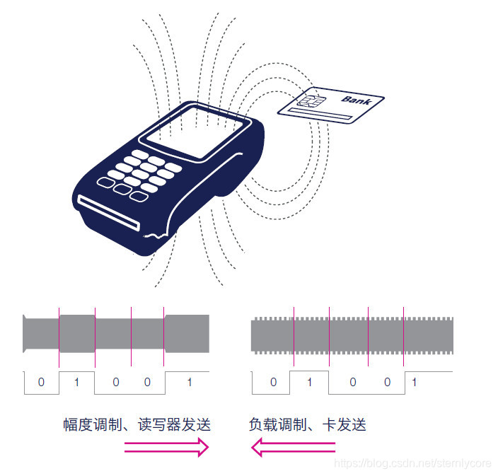
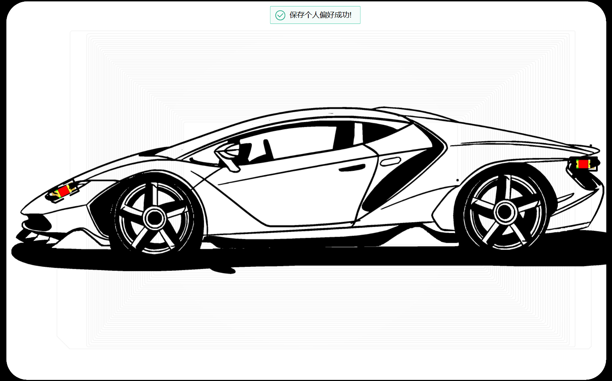
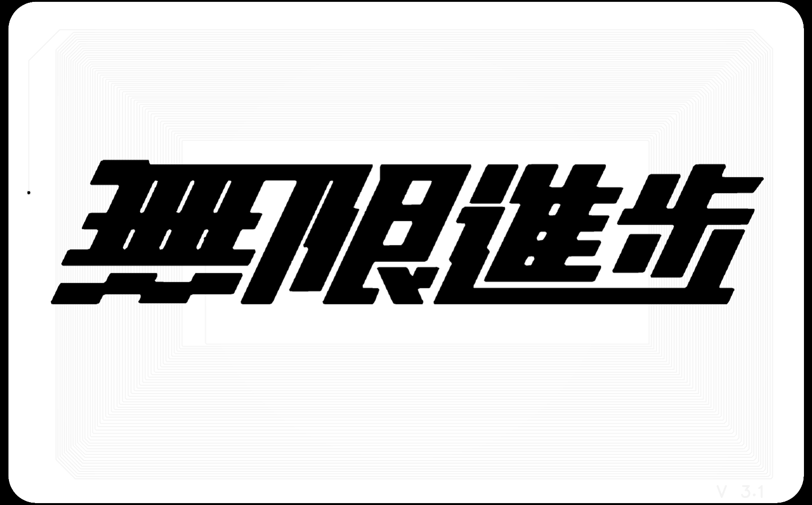
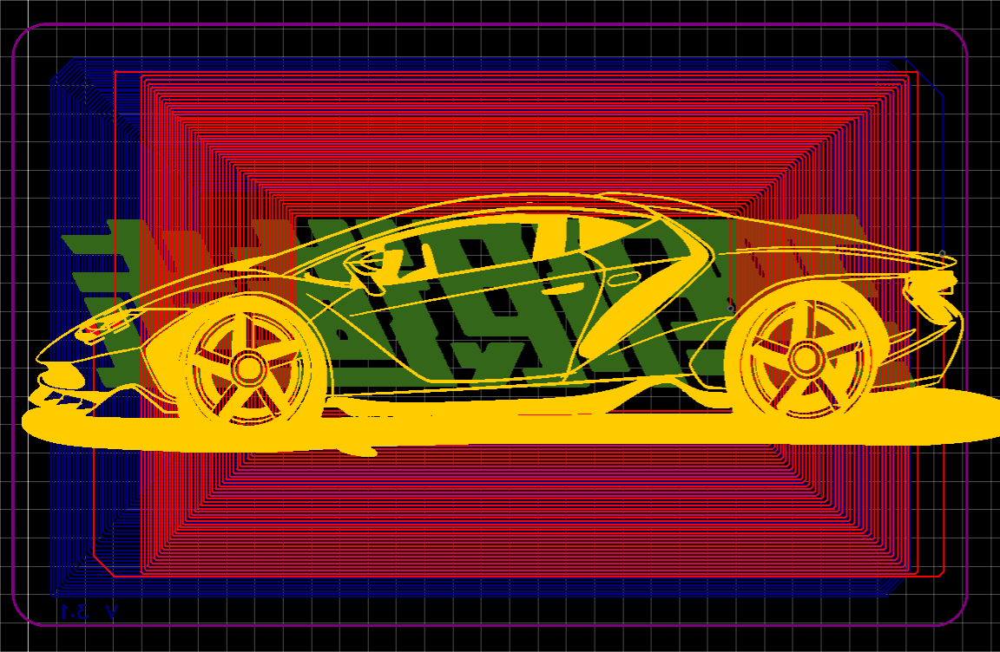

# Led NFC PCB / 发光 NFC 饭卡

这是一个基于 NFC 感应取电的发光饭卡 PCB 项目。卡片靠近读卡器时，线圈从 NFC 场中取能并驱动 LED，实现无电池发光效果。

## 文件结构

- `hardware/ProDoc_发光饭卡.epro`：嘉立创 EDA Pro / EasyEDA Pro 工程源文件
- `assets/images/`：项目截图和实物效果图
- `assets/videos/demo.mp4`：发光效果演示视频

## 使用方式

1. 使用嘉立创 EDA Pro / EasyEDA Pro 打开 `hardware/ProDoc_发光饭卡.epro`。
2. 根据饭卡尺寸、线圈位置和 LED 位置调整 PCB。
3. 打样、贴装后靠近 NFC 读卡器测试发光效果。

## 预览

演示视频：[`assets/videos/demo.mp4`](assets/videos/demo.mp4)
